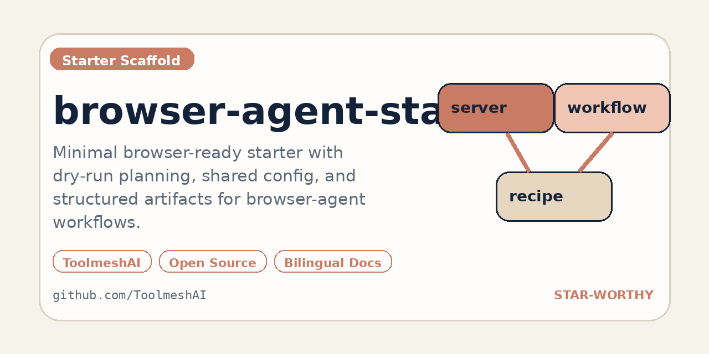

[English](./README.md) | [中文](./README.zh-CN.md)

# browser-agent-starter



一个面向真实 browser agent 工作流的最小可运行 starter，提供 dry-run 规划、统一配置结构和结构化产物。

这个仓库把 3 个高信号 browser-agent 场景变成了可运行的脚手架：

- `docs-audit`
- `signup-smoke-test`
- `pricing-watch`

这个 MVP 刻意保持诚实：当前完整支持的是 dry-run 规划和产物生成，同时预留了基于 `playwright-core` 的浏览器执行接缝，但不假装自己已经是完整自动化引擎。

## 快速证明

- 内置 `docs-audit`、`signup-smoke-test`、`pricing-watch` 三种 starter workflow
- 三个 workflow 共用一套配置结构
- 每次执行都会输出 `run.json` 和 `plan.json`
- 预留浏览器接缝，但不假装自己已经是完整自动化引擎

## 为什么做它

- 很多 browser-agent demo 很炫，但没有 operator handoff，也没有证据产物。
- 团队更需要一个能先跑、先看、再改的 starter，而不是一套脆弱的“假 live”自动化。
- 从 dry-run 和结构化 artifact 起步，比直接堆浏览器脚本更稳。

## 当前能力

- 3 个 workflow 共用一套 JSON 配置结构
- 每次 dry-run 都会输出本地 artifact
- 自动生成 `run.json` 和 `plan.json`
- 内置 docs audit、signup smoke test、pricing watch 三种 planner
- 已经预留 browser adapter 的接入点

## 演示素材

- 社交预览图：[docs/assets/social-preview.png](./docs/assets/social-preview.png)
- 终端截图：[docs/assets/demo-terminal.png](./docs/assets/demo-terminal.png)
- 动图演示：[docs/assets/demo.gif](./docs/assets/demo.gif)

## 快速开始

```bash
npm install
node src/cli.js run docs-audit --config examples/docs-audit.json --output ./tmp/docs-audit --dry-run
```

JSON 输出：

```bash
node src/cli.js run pricing-watch --config examples/pricing-watch.json --output ./tmp/pricing-watch --dry-run --format json
```

## 工作流一览

| Workflow | 适合什么场景 | 主要输出 |
| --- | --- | --- |
| `docs-audit` | 对照产品现实检查公开文档 | audit plan + run artifact |
| `signup-smoke-test` | 在开启 live automation 前先校验注册链路 | checkpoint plan + run artifact |
| `pricing-watch` | 跟踪公开定价页面变化 | watch plan + run artifact |

## 当前状态

- Dry-run 规划：已实现
- Artifact 生成：已实现
- Live 浏览器执行：只保留了 scaffold seam，不是这个 MVP 的重点

## 它不是什么

- 不是完整的 browser-agent runtime
- 不是托管式 orchestration 平台
- 不是鼓励所有 workflow 都立刻全自动化

## 仓库文档

- [设计文档](./docs/superpowers/specs/2026-04-15-browser-agent-starter-design.md)
- [实现计划](./docs/superpowers/plans/2026-04-15-browser-agent-starter.md)
- [发布说明：v0.1.0](./docs/releases/v0.1.0.md)
- [贡献说明](./CONTRIBUTING.md)
- [安全策略](./SECURITY.md)
- [支持说明](./SUPPORT.md)
- [行为准则](./CODE_OF_CONDUCT.md)

## 相关仓库

- [`browser-agent-recipes`](https://github.com/ToolmeshAI/browser-agent-recipes)
  提供内容型 workflow 灵感和 operator 模式
- [`ToolmeshAI`](https://github.com/ToolmeshAI)
  整体的 MCP 与 agent tooling 作品集

## License

MIT
